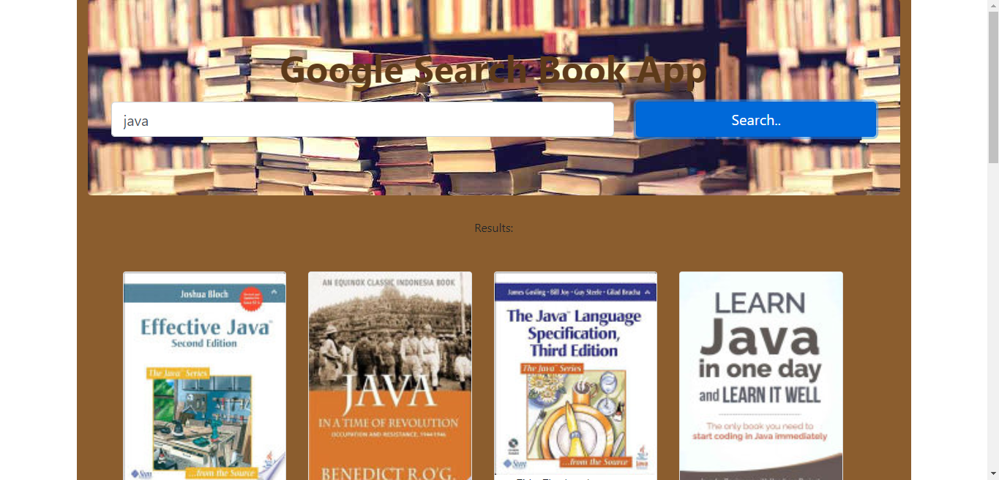

# google-book-search-react

## Overview
In this activity, we create a new React-based Google Books Search app. This app construction used React components, helper/util functions, and utilized React lifecycle methods to query and display books based on user searches. 

## Heroku Links
[Heroku] (https://damp-forest-21791.herokuapp.com/)

## Technologies
* React JS
* JSX
* Bootstrap

## Author
Guillermo Lara
